# Автор: Федорчук Дмитрий Сергеевич DEVOPS-33

# Домашнее задание к занятию «Продвинутые методы работы с Terraform»

### Задание 1

1. Возьмите из [демонстрации к лекции готовый код](https://github.com/netology-code/ter-homeworks/tree/main/04/demonstration1) для создания ВМ с помощью remote-модуля.
2. Создайте одну ВМ, используя этот модуль. В файле cloud-init.yml необходимо использовать переменную для ssh-ключа вместо хардкода. Передайте ssh-ключ в функцию template_file в блоке vars ={} .
Воспользуйтесь [**примером**](https://grantorchard.com/dynamic-cloudinit-content-with-terraform-file-templates/). Обратите внимание, что ssh-authorized-keys принимает в себя список, а не строку.
3. Добавьте в файл cloud-init.yml установку nginx.
4. Предоставьте скриншот подключения к консоли и вывод команды ```sudo nginx -t```.

### Решение 1

1. Склонировал код из демонстрации, изучал его.

2. Создаю одну ВМ используя модуль. Чтобы создать именно одну ВМ потребовалось указать параметр ```instance_count  = 1``` в модуле ```test-vm```.

Чтобы передать ssh-ключ используя функцию template_file пишу в блок vars следующий код:

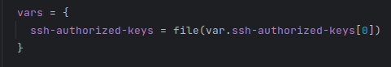

Использую такую конструкцию именно потому, что в задании указано условие, что переменная authorized-keys должна принимать в себя список, а не строку.

Сама переменная ssh-authorized-keys выглядит следующим образом:

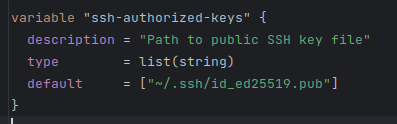

3. Чтобы установить nginx на хост используя cloud-init.yml, нужно в секцию ```packages``` добавить строку ``` - nginx```. В нашем случае после запуска виртуальной машины выполняются следующие действия: обновляется кэш пакетов системы, устанавливается текстовый редактор vim и устанавливается nginx.

Проверяю, что nginx установился:

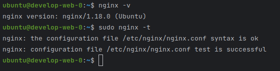

------

### Задание 2

1. Напишите локальный модуль vpc, который будет создавать 2 ресурса: **одну** сеть и **одну** подсеть в зоне, объявленной при вызове модуля, например: ```ru-central1-a```.
2. Вы должны передать в модуль переменные с названием сети, zone и v4_cidr_blocks.
3. Модуль должен возвращать в root module с помощью output информацию о yandex_vpc_subnet. Пришлите скриншот информации из terraform console о своем модуле. Пример: > module.vpc_dev  
4. Замените ресурсы yandex_vpc_network и yandex_vpc_subnet созданным модулем. Не забудьте передать необходимые параметры сети из модуля vpc в модуль с виртуальной машиной.
5. Откройте terraform console и предоставьте скриншот содержимого модуля. Пример: > module.vpc_dev.
6. Сгенерируйте документацию к модулю с помощью terraform-docs.    
 
Пример вызова

```
module "vpc_dev" {
  source       = "./vpc"
  env_name     = "develop"
  zone = "ru-central1-a"
  cidr = "10.0.1.0/24"
}
```

### Решение 2

1. Написал локальный модуль с одной сетью и одной подсетью в зоне ```ru-central1-a```.

2. В модуле используются переменные с именем сети, зоны и cidr блок:

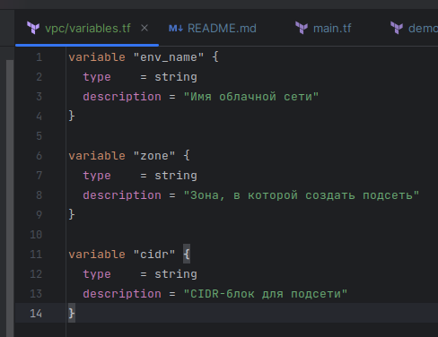

3. В terraform console проверю, какой output будет показан при вызове модуля ```module.vpc_dev```:

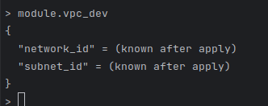

4. Заменил сетевые ресурсы созданным модулем:

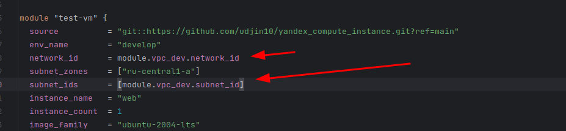

5. В root модуле написал следующий output:

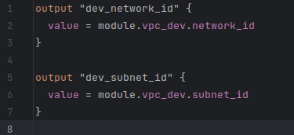

Вывод ```module.vpc_dev``` не изменился:

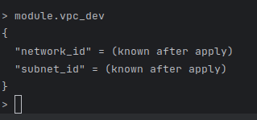

6. С помощью terraform-docs сгенерировал файл документации. Смотреть файл DOCS.md.

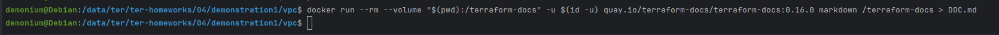

### Задание 3
1. Выведите список ресурсов в стейте.
2. Полностью удалите из стейта модуль vpc.
3. Полностью удалите из стейта модуль vm.
4. Импортируйте всё обратно. Проверьте terraform plan. Изменений быть не должно.
Приложите список выполненных команд и скриншоты процессы.

### Решение 3

1. Текущий список ресурсов в стейте:

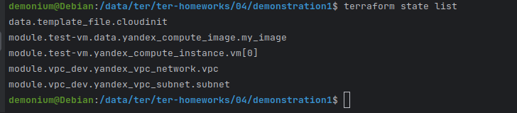

2. Полностью удалил из стейта модуль vpc_dev:

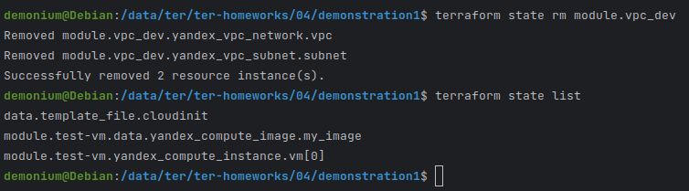

3. Полностью удалил из стейта модуль test-vm:

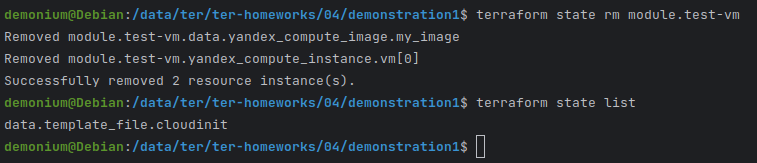

4. Обратно импортирую удаленные стейты:

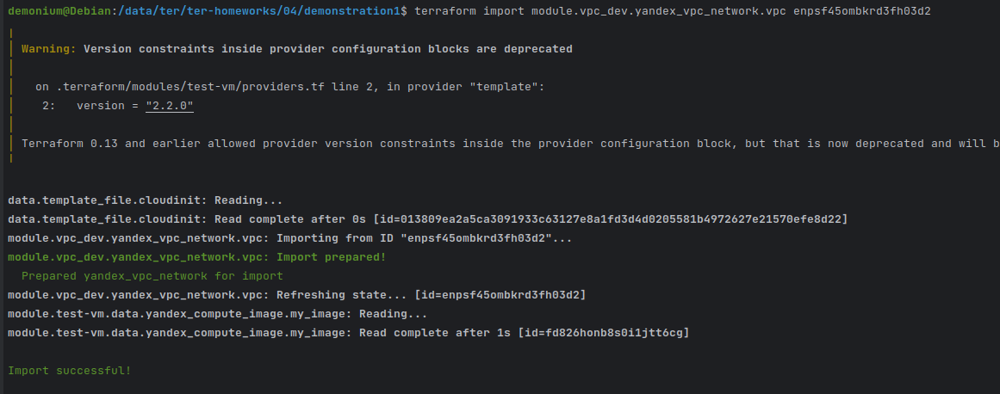

Аналогичными командами импортирую остальные стейты:

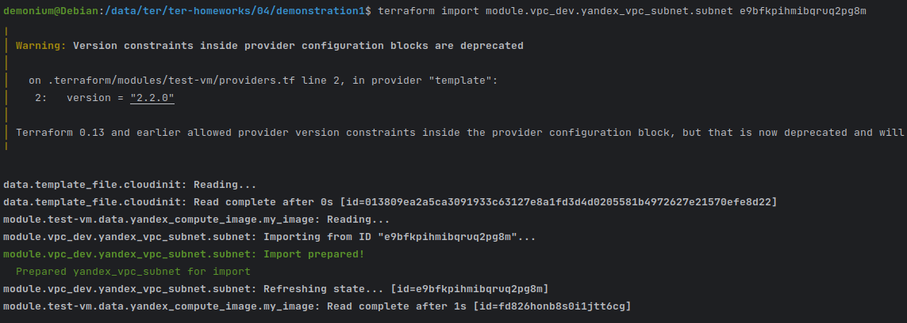

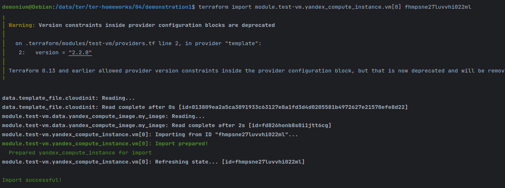

После импортирования модулей изменений не последовало.

# Листинг кода по заданиям 1-3 можно посмотреть по [ссылке](https://github.com/DemoniumBlack/fedorchukds-devops-33-14/tree/main/SRC/1-3).

### Задание 4*

1. Измените модуль vpc так, чтобы он мог создать подсети во всех зонах доступности, переданных в переменной типа list(object) при вызове модуля.  
  
Пример вызова
```
module "vpc_prod" {
  source       = "./vpc"
  env_name     = "production"
  subnets = [
    { zone = "ru-central1-a", cidr = "10.0.1.0/24" },
    { zone = "ru-central1-b", cidr = "10.0.2.0/24" },
    { zone = "ru-central1-c", cidr = "10.0.3.0/24" },
  ]
}

module "vpc_dev" {
  source       = "./vpc"
  env_name     = "develop"
  subnets = [
    { zone = "ru-central1-a", cidr = "10.0.1.0/24" },
  ]
}
```

Предоставьте код, план выполнения, результат из консоли YC.

### Решение 4

1. Изменил модуль vpc, использовал переменную типа list. В YC получил следующий результат:

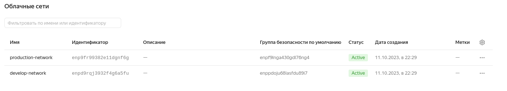

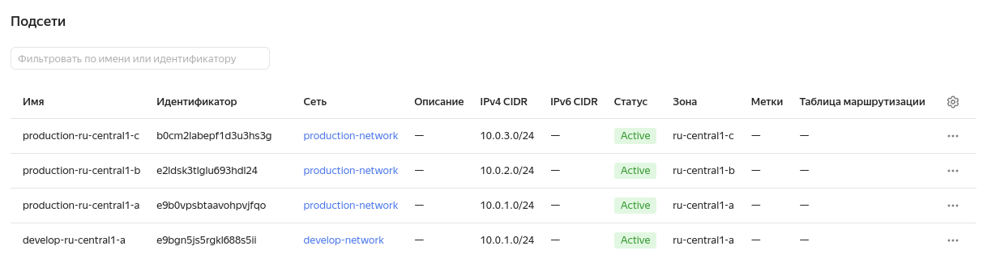

# Листинг кода по заданию 4 можно посмотреть по [ссылке](https://github.com/DemoniumBlack/fedorchukds-devops-33-14/tree/main/SRC/4).

### Задание 5*

1. Напишите модуль для создания кластера managed БД Mysql в Yandex Cloud с одним или тремя хостами в зависимости от переменной HA=true или HA=false. Используйте ресурс yandex_mdb_mysql_cluster: передайте имя кластера и id сети.
2. Напишите модуль для создания базы данных и пользователя в уже существующем кластере managed БД Mysql. Используйте ресурсы yandex_mdb_mysql_database и yandex_mdb_mysql_user: передайте имя базы данных, имя пользователя и id кластера при вызове модуля.
3. Используя оба модуля, создайте кластер example из одного хоста, а затем добавьте в него БД test и пользователя app. Затем измените переменную и превратите сингл хост в кластер из 2-х серверов.
4. Предоставьте план выполнения и по возможности результат. Сразу же удаляйте созданные ресурсы, так как кластер может стоить очень дорого. Используйте минимальную конфигурацию.

# Задание 5 решил пока не делать

### Задание 6*

1. Разверните у себя локально vault, используя docker-compose.yml в проекте.
2. Для входа в web-интерфейс и авторизации terraform в vault используйте токен "education".
3. Создайте новый секрет по пути http://127.0.0.1:8200/ui/vault/secrets/secret/create
Path: example  
secret data key: test 
secret data value: congrats!  
4. Считайте этот секрет с помощью terraform и выведите его в output по примеру:
```
provider "vault" {
 address = "http://<IP_ADDRESS>:<PORT_NUMBER>"
 skip_tls_verify = true
 token = "education"
}
data "vault_generic_secret" "vault_example"{
 path = "secret/example"
}

output "vault_example" {
 value = "${nonsensitive(data.vault_generic_secret.vault_example.data)}"
} 

Можно обратиться не к словарю, а конкретному ключу:
terraform console: >nonsensitive(data.vault_generic_secret.vault_example.data.<имя ключа в секрете>)
```
5. Попробуйте самостоятельно разобраться в документации и записать новый секрет в vault с помощью terraform. 

### Решение 6

1. Развернул у себя контейнер Vault. Для этого понадобилось поправить версию запускаемого образа, т.к. манифеста с тегом latest не было, запустил vault с тегом 1.13.3.

2. Авторизовался в vault используя токен "education".

3. Создал секрет по указанному пути с указанными параметрами.

4. Считал созданный секрет:


5. Чтобы написать новый секрет vault, нужно создать новый ресурс:

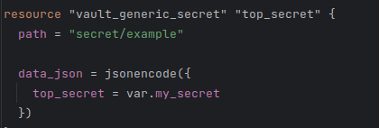

С помощью него будем создавать новый секрет. Расположение секрета остается прежним - в example, имя - top_secret, значение - Swordfish:

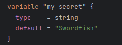

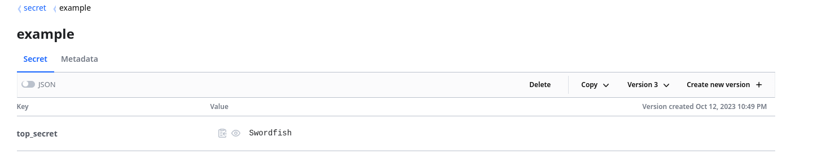

В outputs получаем новый секрет:

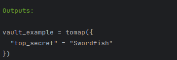

# Листинг кода по заданию 6 можно посмотреть по [ссылке](https://github.com/DemoniumBlack/fedorchukds-devops-33-14/tree/main/SRC/6/vault).